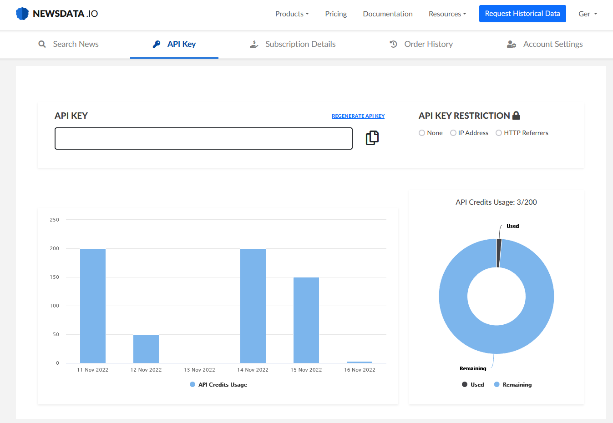
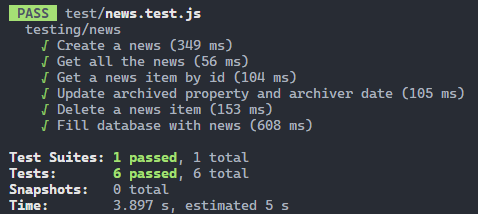
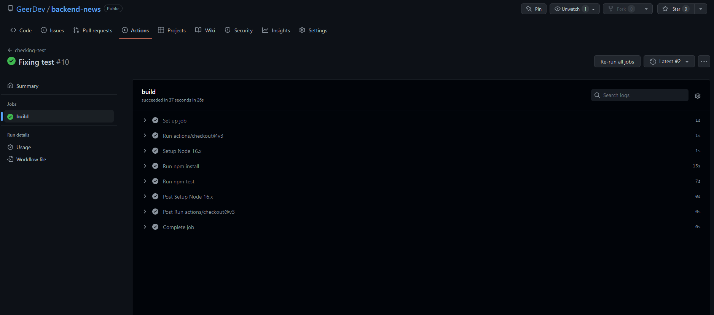
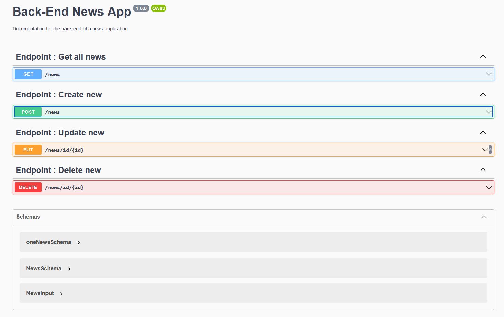
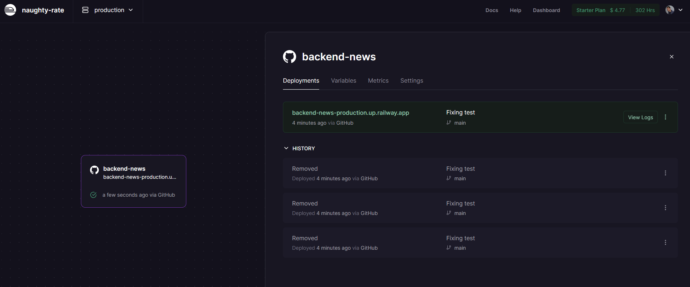

# Back-End App News

_Crearemos un prototipo de back-end que proporcione y gestione información sobre noticias a los usuarios utilizando MongoDB, Mongoose y NodeJS_

## Api usada para sacar datos de las noticias ☑️

Para poblar nuestra base de datos en MongoDB hemos utilizado una API externa que contiene noticias de actualidad:

## Tecnologias utilizadas 🚀

El proyecto ha sido desarrollado utilizando los siguientes paquetes en Nodejs:

* Nodemon
* Expresss
* Mongoose
* Dotenv
* Axios
* Swagger-ui-express
* Cors
* Multer
* Jest
* Supertest

## ¿Como desplegar el proyecto en local? 📋

Estas instrucciones te permitirán obtener una copia del proyecto en funcionamiento en tu máquina local para propósitos de desarrollo:

Clonarte el repositorio localmente:

> git clone [url del repositorio]

Instalar las depedencias necesarias:

> npm i

Rellenar las variables necesarias en el archivo .env.example para iniciar el proyecto, despues cambiarle el nombre a .env:

> >   -  Puerto en el que quieras que se ejecute el server, PORT
> >   -  Cadena de conexión con la base de datos en Mongo Atlas, MONGO_URI
> >   -  Cadena de conexión con la base de datos en modo "Test", MONGO_URI_TEST

Arrancar el proyecto:

> npm start

## Endpoints y middlewares 🛠️

El sistema ataca al modelo "New" del que disponemos en la base de datos, y puede realizar estas acciones (endpoints):

- fillDatabase: Ejecuta las llamadas a una API externa para poblar nuestra base de datos con los suyos
- getAll: Devuelve todas las noticias ordenadas por ingreso en la base de datos
- getById: Devuelve una noticia filtrada por Id
- showCategories: Devuelve todas las categorias existentes en las noticias en la base de datos
- findNewsByCategory: Encuentra las noticias filtradas por la categoria que le indiques
- searchByTitle: Realiza la busqueda por título de una noticia, también filtra por categoria
- create: Crea una noticia
- updateArchived: Actualiza las propiedades de "archived" y "archiveDate" en una noticia filtrada por Id
- delete: Borra la noticia por Id

Los middlewares implementados en este proyecto son los siguientes:

- errors: Controla que se cumplan las validaciones que tenemos en los modelos de la base de datos a la hora de crear una noticia
- multer: Nos permite poder subir imágenes al servidor

## Testing con Jest y Supertest 🎯

Mediante Jest y Supertest hemos testeado algunos de los endpoints de nuestro back, además hemos configurado nuestro sistema para que ataque a una base de datos diferente a la desarrollo:

Comando para ejecutar los tests:

> npm test

## Integración continua: Github Actions 📌

Hemos configurado un workflow para que esté escuchando cuando se producen pusheos o pull request a nuestra rama "main" y en esa caso que ejecute los tests implementados, también configuramos un "secret" que contiene nuestra conexión a la base de datos de testing:

## Documentación con Swagger 📚

Utilizando Swagger hemos podido documentar los siguientes endpoints del proyecto:

- Get all news
- Create new
- Update new
- Delete new

## Despliegue en Railway 🏗️

El proyecto se encuentra desplegado en Railway, se pueden ejecutar sus endpoints y ver su documentación en el siguiente enlace:

https://backend-news-production.up.railway.app/

---

😀 Hecho por [Germán Fernández](https://www.linkedin.com/in/geerdev/) 🧑‍💻